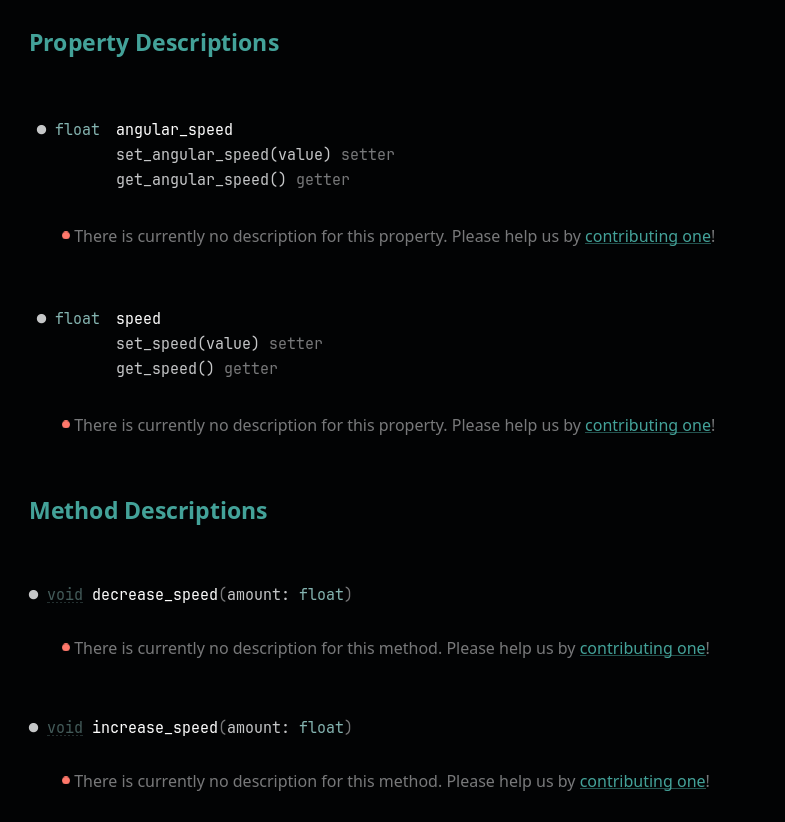
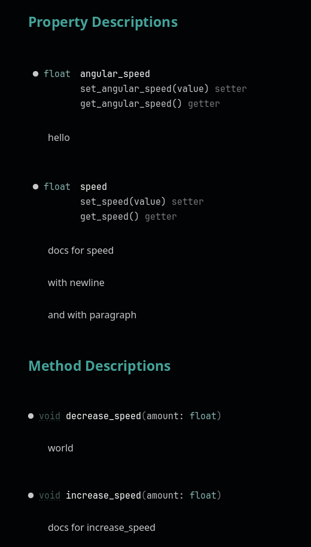

# bug report for godot rust docs

1. download godot v4.3 beta3 and place at `bin/godot.exe`
2. `cd docstest && cargo build`
3. move compiled dll into `bin` folder of repo root
4. note how docs (Script Editor -> F1 -> "Player") are missing for every method and member:

   
   
5. add docs comment to `angular_speed` and `decrease_speed`, repeat steps 2 and 3 (if you keep godot open, close and re-open the docs tab)
6. now the docs are complete:

   

